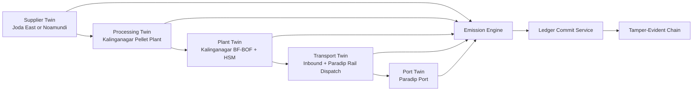

# Digital Twin-Based Emission Tracking for Indian Hot-Rolled Coil

## 1. Selected Product and Real Supply Chain

### Selected product
- Product: `Hot-Rolled Coil (HRC)`
- Industrial anchor: `Tata Steel Kalinganagar, Odisha`
- Supply-chain boundary: `Iron ore mine -> pellet plant -> integrated steel plant -> rail dispatch -> Paradip Port`
- Reference batch used in this backend: `1,000 t HRC`

### Why this product was selected
- Tata Steel publicly documents an end-to-end Indian value chain from captive mining to finished steel.
- Kalinganagar is a real integrated flat-steel cluster with a pellet plant, coke plant, blast furnace, and downstream rolling.
- Odisha's mineral belt and the Paradip corridor are documented by Indian public-sector sources, so the chain can be modeled with a real logistics spine instead of a hypothetical one.

### Real-world chain used in the implementation
1. `Supplier A`: Joda East Iron Mine, Keonjhar, Odisha.
2. `Supplier B`: Noamundi Iron Mine, West Singhbhum, Jharkhand.
3. `Processing unit`: Kalinganagar Pellet Plant.
4. `Plant`: Kalinganagar Integrated Steel Plant and Hot Strip Mill.
5. `Transport unit`: Kalinganagar-Paradip rail corridor with inbound mine logistics.
6. `Port`: Paradip Port, Odisha.

### Core India-specific evidence used
- Tata Steel states that its Indian business runs an end-to-end value chain from mining to finished steel products and that captive mines supply most of its iron ore requirements.
- Tata Steel's 2024 Kalinganagar expansion note explicitly lists a pellet plant, coke plant, and a new blast furnace with dry gas cleaning and top-gas recovery.
- The Ministry of Ports annual report states that the Jajpur/Kalinganagar industrial belt is connected to Paradip by rail and road and highlights the Haridaspur-Paradip link.
- Paradip Port publishes that its multipurpose clean cargo berth handles iron and steel products and that the port has its own railway system connected to East Coast Railway.

## 2. System Architecture

### Architectural intent
This backend is a `Ditto-style twin registry + explainable emissions engine + Hyperledger-style audit chain` for one concrete Indian steel export path.

### Linux Foundation and adjacent ecosystem mapping
- `EdgeX Foundry-inspired ingestion`: adapters for mine ERP, plant MES, weighbridges, rail dispatch, and port systems.
- `Eclipse Ditto-inspired twin model`: every node is represented as a thing with structured features.
- `OpenTelemetry / CNCF style tracing`: one batch correlation id across all state transitions.
- `Hyperledger Fabric-inspired ledger`: each stage commits a block with `previous_hash` and `current_hash`.
- `Kubernetes-native deployment`: the design assumes stateless API replicas over a persistent twin and ledger store.

### Runtime flow


### Backend services implemented
- `Twin Registry Service`: produces Ditto-like thing JSON for supplier, processing, plant, transport, and port.
- `Emission Engine`: calculates Scope 1, Scope 2, and Scope 3 at stage level.
- `Material Flow Orchestrator`: maintains tonnage conversion across ore, pellets, liquid steel equivalent, and HRC.
- `Scenario Comparator`: compares Supplier A and Supplier B for the same batch.
- `Ledger Commit Service`: writes one block per stage with chained hashes.

## 3. Twin JSON Structures

The backend returns full twin payloads from `POST /india-steel-twin/simulate`. Representative generated structures for the lower-emission `supplier_b` case are below.

### Supplier twin
```json
{
  "thingId": "supplier:noamundi-iron-mine",
  "policyId": "org.carbonship.india.steel.policy.kalinganagar",
  "definition": "org.eclipse.ditto:SupplierTwin:1.0.0",
  "attributes": {
    "operator": "Tata Steel",
    "state": "Jharkhand",
    "district": "West Singhbhum",
    "real_world_anchor": "Noamundi mining belt, West Singhbhum, Jharkhand"
  },
  "features": {
    "location": {
      "properties": {
        "lat": 22.144148,
        "lon": 85.491016
      }
    },
    "materialFlow": {
      "properties": {
        "material": "iron_ore_fines",
        "output_tonnes": 1630.0,
        "destination": "processing:kalinganagar-pellet-plant",
        "dispatch_mode": "rail",
        "distance_km": 205.0
      }
    },
    "emission": {
      "properties": {
        "reporting_scope": "scope_3",
        "total_tco2": 14.816
      }
    },
    "status": {
      "properties": {
        "current": "dispatched",
        "previous": "raw_extracted"
      }
    }
  }
}
```

### Processing twin
```json
{
  "thingId": "processing:kalinganagar-pellet-plant",
  "definition": "org.eclipse.ditto:ProcessingTwin:1.0.0",
  "features": {
    "materialFlow": {
      "properties": {
        "input_material": "iron_ore_fines",
        "input_tonnes": 1630.0,
        "output_material": "pellets",
        "output_tonnes": 1520.0
      }
    },
    "emission": {
      "properties": {
        "scope_1_tco2": 107.844,
        "scope_2_tco2": 52.2394,
        "total_tco2": 160.0834
      }
    },
    "status": {
      "properties": {
        "current": "transferred_to_steelmaking"
      }
    }
  }
}
```

### Plant twin
```json
{
  "thingId": "plant:kalinganagar-integrated-steel",
  "definition": "org.eclipse.ditto:PlantTwin:1.0.0",
  "attributes": {
    "process_route": "Pellet -> Blast Furnace -> BOF -> Hot Strip Mill"
  },
  "features": {
    "materialFlow": {
      "properties": {
        "input_tonnes": 1520.0,
        "liquid_steel_equivalent_tonnes": 1030.0,
        "output_material": "hot_rolled_coil",
        "output_tonnes": 1000
      }
    },
    "emission": {
      "properties": {
        "scope_1_tco2": 1899.755,
        "scope_2_tco2": 193.32,
        "total_tco2": 2093.075
      }
    }
  }
}
```

### Transport twin
```json
{
  "thingId": "transport:kalinganagar-paradip-corridor",
  "definition": "org.eclipse.ditto:TransportTwin:1.0.0",
  "features": {
    "materialFlow": {
      "properties": {
        "inbound_leg": {
          "material": "iron_ore_fines",
          "tonnes": 1630.0,
          "mode": "rail",
          "distance_km": 205.0
        },
        "outbound_leg": {
          "material": "hot_rolled_coil",
          "tonnes": 1000,
          "mode": "rail",
          "distance_km": 124.7
        }
      }
    },
    "emission": {
      "properties": {
        "scope_1_tco2": 12.8506,
        "total_tco2": 12.8506
      }
    }
  }
}
```

### Port twin
```json
{
  "thingId": "port:paradip-port",
  "definition": "org.eclipse.ditto:PortTwin:1.0.0",
  "attributes": {
    "terminal_reference": "PICTPL multipurpose clean cargo berth for iron and steel products"
  },
  "features": {
    "materialFlow": {
      "properties": {
        "input_material": "hot_rolled_coil",
        "input_tonnes": 1000,
        "status": "ready_for_vessel_loading"
      }
    },
    "emission": {
      "properties": {
        "scope_2_tco2": 1.79,
        "total_tco2": 1.79
      }
    }
  }
}
```

## 4. Emission Engine

### Scope logic used in this system
- `Scope 3`: supplier and material sourcing burden at the mine stage.
- `Scope 2`: electricity-driven emissions at pellet plant, steel plant, and port.
- `Scope 1`: process fuel emissions and distance-based logistics emissions.

### Fixed factors used
- Indian grid factor: `0.716 tCO2/MWh`
- Diesel combustion: `0.00268 tCO2/litre`
- Solid process fuel: `0.0946 tCO2/GJ`
- Reheat or mixed gaseous fuel: `0.0561 tCO2/GJ`
- Rail freight: `0.000028 tCO2/t-km`
- Road truck freight: `0.000064 tCO2/t-km`

### Formula set

#### Supplier Scope 3
`ore_tonnes x ((diesel_l_per_t_ore x diesel_tCO2_per_litre) + (electricity_kWh_per_t_ore / 1000 x grid_tCO2_per_MWh))`

#### Processing Scope 1
`pellets_tonnes x thermal_GJ_per_t_pellet x solid_fuel_tCO2_per_GJ`

#### Processing Scope 2
`pellets_tonnes x electricity_MWh_per_t_pellet x grid_tCO2_per_MWh`

#### Plant Scope 1
`batch_tonnes x ((ironmaking_GJ_per_t_HRC x solid_fuel_tCO2_per_GJ) + (hot_rolling_GJ_per_t_HRC x reheat_fuel_tCO2_per_GJ))`

#### Plant Scope 2
`batch_tonnes x electricity_MWh_per_t_HRC x grid_tCO2_per_MWh`

#### Transport Scope 1
`(ore_tonnes x mine_to_processing_km x supplier_mode_factor) + (batch_tonnes x plant_to_port_km x rail_factor)`

#### Port Scope 2
`batch_tonnes x port_handling_MWh_per_t_HRC x grid_tCO2_per_MWh`

## 5. Material Flow and Stage Emissions

### Verified `supplier_b` execution for `1,000 t HRC`
- Ore input: `1,630 t`
- Pellets to BF: `1,520 t`
- Liquid steel equivalent: `1,030 t`
- Final HRC to port: `1,000 t`

### Stage-wise emissions

| Stage | Scope 1 | Scope 2 | Scope 3 | Total tCO2 |
|---|---:|---:|---:|---:|
| Supplier | 0.0000 | 0.0000 | 14.8160 | 14.8160 |
| Processing | 107.8440 | 52.2394 | 0.0000 | 160.0834 |
| Plant | 1899.7550 | 193.3200 | 0.0000 | 2093.0750 |
| Transport | 12.8506 | 0.0000 | 0.0000 | 12.8506 |
| Port | 0.0000 | 1.7900 | 0.0000 | 1.7900 |
| **Total** | **2020.4496** | **247.3494** | **14.8160** | **2282.6150** |

### Interpretation
- The plant stage dominates because HRC is produced through an integrated BF-BOF route.
- Supplier choice matters mainly through upstream ore factor and inbound logistics, not through the core thermochemical steelmaking burden.
- The modeled intensity is `2.2826 tCO2/t HRC`, close to worldsteel's BF-BOF benchmark and below India's broader sector average of about `2.54 tCO2/t crude steel`.

## 6. Multiple Supplier Scenario

### Scenario definitions
- `Supplier A`: Joda East, nearer to Kalinganagar, truck-led, higher ore and preparation factor.
- `Supplier B`: Noamundi, farther from Kalinganagar, rail-led, lower upstream factor.

### Verified comparison for `1,000 t HRC`

| Scenario | Supplier | Mine to plant mode | Mine to plant km | Total tCO2 | Intensity tCO2/t HRC |
|---|---|---|---:|---:|---:|
| A | Joda East Iron Mine | Road truck | 173.6 | 2299.3322 | 2.2993 |
| B | Noamundi Iron Mine | Rail | 205.0 | 2282.6150 | 2.2826 |

### Delta
- Best scenario: `supplier_b`
- Worst scenario: `supplier_a`
- Absolute savings: `16.7172 tCO2` per `1,000 t HRC`
- Relative savings: `0.727%`
- Scope 3 reduction: `31.276%`

### Academic takeaway
The result is intentionally realistic: supplier choice does not erase the thermochemical burden of integrated steelmaking, but it still produces a measurable and auditable reduction in upstream and logistics emissions.

## 7. Blockchain Ledger Structure

### Block structure used
```json
{
  "index": 2,
  "timestamp": "2026-03-22T17:00:00+05:30",
  "previous_hash": "dbe3e4d2f3e3bb633ac9a360cc42a52225bb2726a5944e9460681c2b99b67c86",
  "current_hash": "f77525ba9893bdb4a814d7be6b056129dd91c7a00770d8478f0418f607d28721",
  "stage_name": "Processing",
  "twin_id": "processing:kalinganagar-pellet-plant",
  "emission_tco2": 160.0834,
  "material_tonnes": 1520.0,
  "payload": {
    "scope_breakdown": {
      "scope_1_tco2": 107.844,
      "scope_2_tco2": 52.2394,
      "scope_3_tco2": 0.0
    },
    "primary_driver": "Pellet induration fuel and pellet plant electricity"
  }
}
```

### Why this is immutable
- Every block hash is computed from the stage payload plus the previous hash.
- If any value is edited after the fact, the block hash changes and all later blocks become invalid.

### Why this is traceable
- Each block binds one stage, one twin id, one timestamp, one material quantity, and one emission value.
- A professor, auditor, or buyer can replay the chain from ore extraction to port readiness.

## 8. Step-by-Step Execution Example

### Example timeline for `supplier_b`
1. `2026-03-22T09:00:00+05:30`: Noamundi twin dispatches `1,630 t` of ore and records `14.816 tCO2` Scope 3.
2. `2026-03-22T17:00:00+05:30`: Kalinganagar pellet twin converts ore into `1,520 t` of pellets and records `160.0834 tCO2`.
3. `2026-03-23T01:00:00+05:30`: Plant twin generates `1,000 t` HRC and records `2093.075 tCO2`.
4. `2026-03-23T09:00:00+05:30`: Transport twin closes inbound and outbound logistics and records `12.8506 tCO2`.
5. `2026-03-23T17:00:00+05:30`: Paradip port twin marks the batch as `ready_for_vessel_loading` and records `1.79 tCO2`.

## 9. Backend Endpoints

### New endpoints implemented
- `GET /india-steel-twin/context`
- `GET /india-steel-twin/scenarios`
- `POST /india-steel-twin/simulate`
- `POST /india-steel-twin/compare`

### Example request
```json
{
  "scenario_id": "supplier_b",
  "batch_tonnes": 1000.0
}
```

## 10. India Context and Real-Life Utility

### Why this system is useful in practice
- It gives an Indian steel exporter a batch-level emission record instead of a single annual factor.
- It lets procurement teams compare mines and dispatch modes before issuing rail or truck plans.
- It gives ESG and compliance teams a traceable audit trail for CBAM-style buyer questionnaires.
- It creates a basis for integrating actual OT and ERP telemetry later without changing the twin contract.

### Where this could be extended next
- Add coke, limestone, and ferro-alloy sub-twins for a fuller material tree.
- Replace estimated route factors with actual rake movement, GPS, or E-way bill data.
- Persist twin snapshots and blocks in PostgreSQL plus an object store.
- Add a Fabric chaincode adapter if the simulated ledger is later promoted to a real consortium network.

## 11. Source List

- [Tata Steel Integrated Report 2022-23 - Operations and Product Portfolio](https://www.tatasteel.com/investors/integrated-report-2022-23/operations-and-product-portfolio.html)
- [Tata Steel commissions India's largest blast furnace at Kalinganagar](https://www.tatasteel.com/media/newsroom/press-releases/india/2024/tata-steel-commissions-indias-largest-blast-furnace-at-kalinganagar/)
- [Responsible and Sustainable Mining | Tata Steel](https://www.tatasteel.com/sustainability/environment/sustainable-mining/)
- [Tata Steel OMQ compliance listing for Joda East Iron Mines](https://www.tatasteel.com/media/25240/nim-ec-comp-apr25-sep25.pdf)
- [Ministry of Ports, Shipping and Waterways Annual Report 2024-25](https://shipmin.gov.in/sites/default/files/Annual%20Report%202024-25%20-%20English.pdf)
- [Paradip Port Infrastructure](https://www.paradipport.gov.in/Infrastructure.aspx)
- [CEA CO2 Baseline Database for the Indian Power Sector](https://cea.nic.in/cdm/?lang=en)
- [Ministry of Steel - Lok Sabha Unstarred Question No. 4029](https://steel.gov.in/sites/default/files/2025-04/lu4029.pdf)
- [worldsteel BF-BOF intensity reference](https://worldsteel.org/about-steel/facts/steelfacts/climate-action/what-is-the-average-co2-intensity-for-the-bf-bof-and-eaf/)
